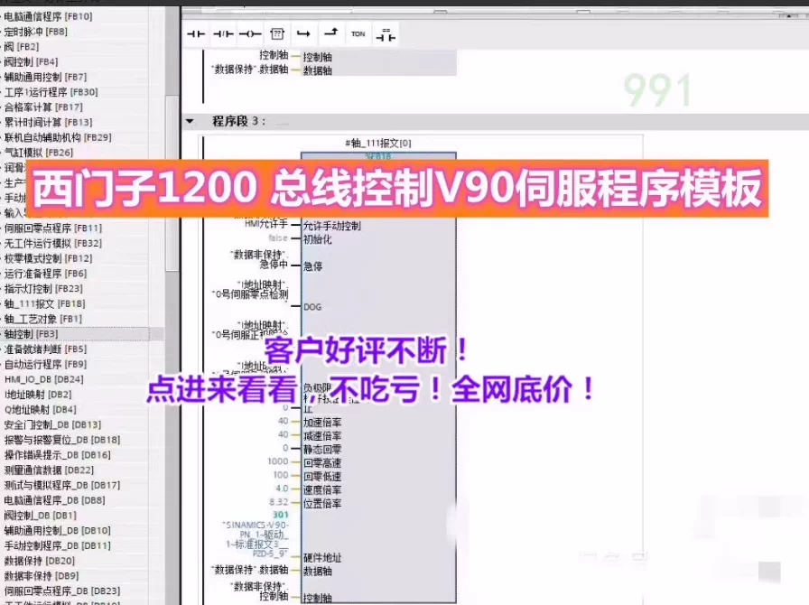
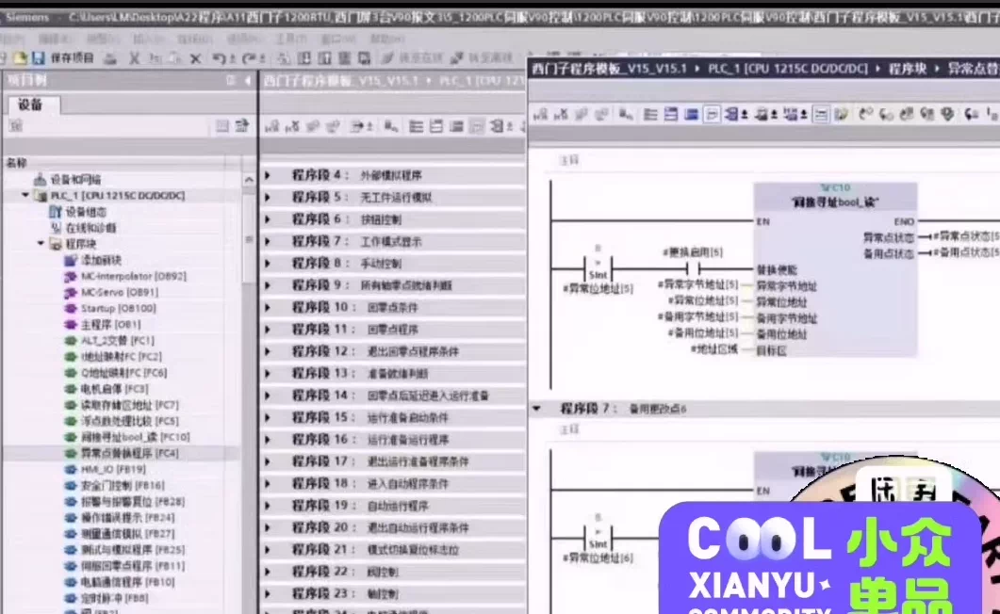
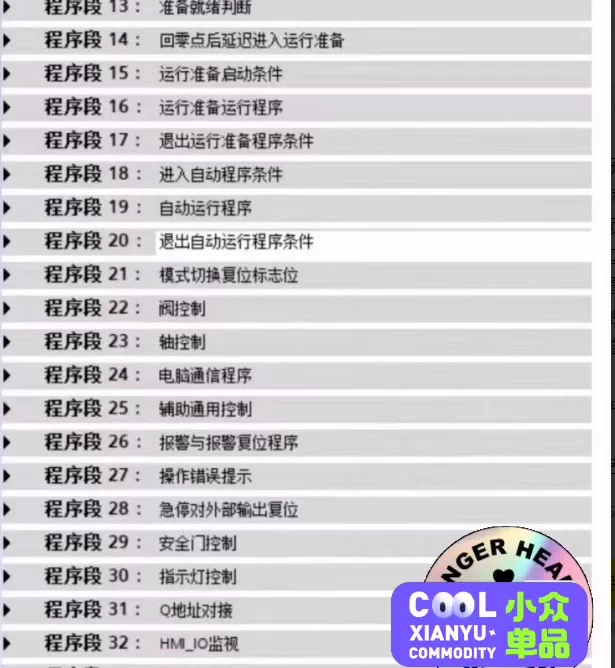
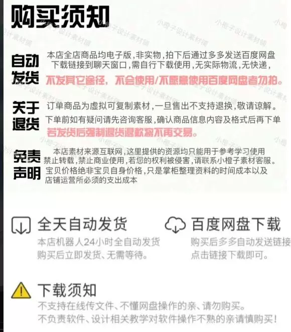

# Professional Siemens 1200 Bus Control V90 Servo Program Template

## Body

Professional S7-1200 Bus Control V90 Servo Program Template
Professional S7-1200 Bus Control V90 Servo Program Template
Professional S7-1200 Bus Control V90 Servo Program Template

Professional S7-1200 Bus Control V90 Servo Program Template
Includes PLC program, Siemens touchscreen program, one Eplan electrical drawing
Real Engineering Project Case
3. This case includes:
①V15 Bosch program
②Siemens touchscreen program
③Project circuit drawing

There are two control modes for the servo:
1. The PN communication control V90 servo program based on 111 message self-written by PROFIBUS.
2. The PN communication control V90 servo program based on PROFIdrive configured axis program.
The program can be directly copied and used, including a complete set of Eplan drawings, including equipment drawing templates.
The program includes all functions of a machine:
1) Manual control
(2) Automated control
(3) Cylinder control
(4) Mdbus communication
(5) Alarm and reset
(6) Production rhythm

Since the program can be copied, it is not refundable or exchangeable!
Users who purchase will receive continuous positive feedback after purchasing. Now, place an order, and the网盘 will automatically ship immediately!

## Images

## Payment

Here is a pay link on Stripe ( https://buy.stripe.com/3cs8yP7sY87d0vu9AB ). Please contact me lonlonago@foxmail.com after funding $89, and I will send you a complete data files , thank you!

